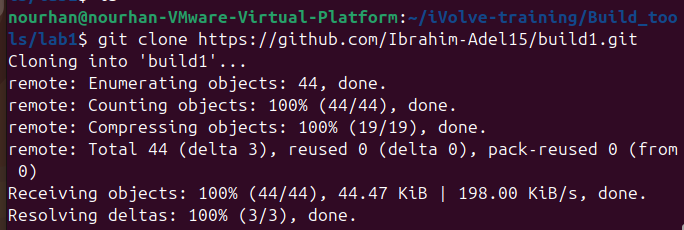
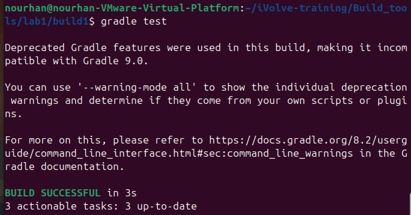
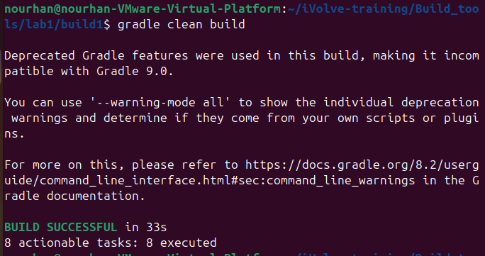
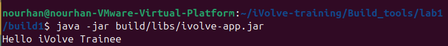

# Lab1: Build Tools Lab

## Objective
This lab demonstrates building a project using Gradle and running tests to verify the build.

## Requirements
- Java JDK 17
- Gradle
- Git

## Steps:
### 1. Clone the Repository:
```bash
        git clone  https://github.com/Ibrahim-Adel15/build1.git
```


### 2. Test the Repository:
```bash
        gradle test
```


### 3. Build the Repository:
```bash
        gradle build
```



### 4. Run the Repository:
```bash
    java -jar build/libs/ivolve-app.jar
```



