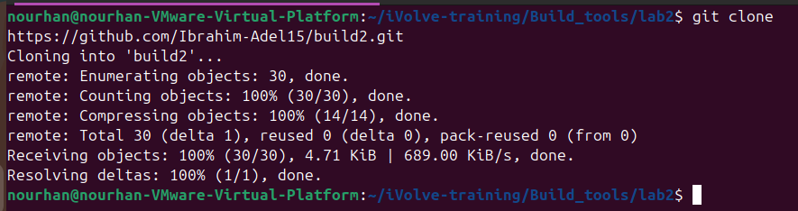
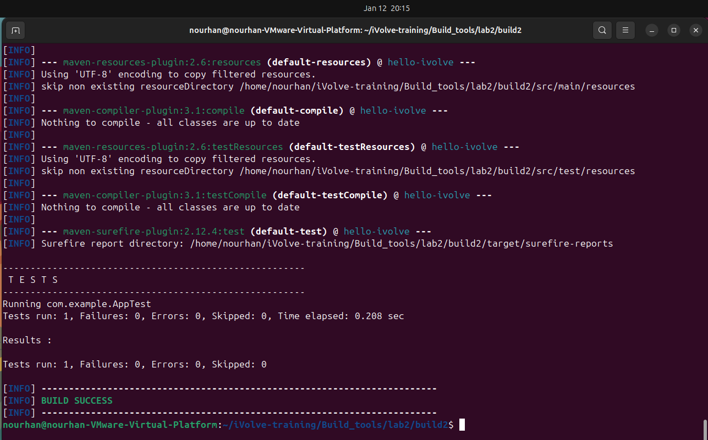
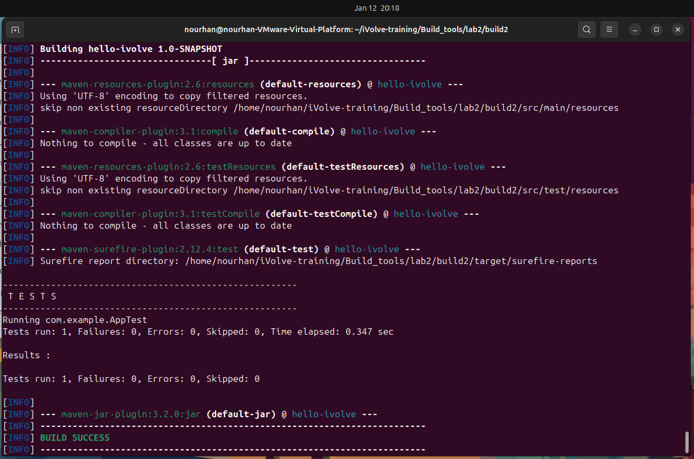
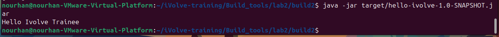

# Lab2: Building and Packaging Java Applications with Maven

## Summary
In this lab, you will learn how to build and package a Java application using Maven. 
You will:
- Clone the source code from GitHub
- Run unit tests to verify functionality
- Build the application and generate a `.jar` artifact
- Run the application and ensure it works as expected

This lab helps you understand the Maven lifecycle and how to manage Java projects efficiently.

## Objective
This lab demonstrates how to build and package a Java application using Maven, run unit tests, and verify the generated artifact.

## Requirements
- Java JDK 17
- Maven
- Git

## Steps

### 1. Install Maven:
Make sure Maven is installed on your system.
```bash
        mvn -v
```
### 2.Clone the Repository:
```bash
         https://github.com/Ibrahim-Adel15/build2.git
```


### 3.test the Repository:
```bash 
         mvn test
```


### 2.Clone the Repository:
```bash 
         mvn package
```



### 2.Clone the Repository:
```bash 
         java -jar target/hello-ivolve-1.0-SNAPSHOT.jar

```



