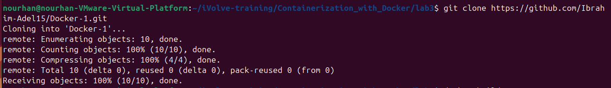
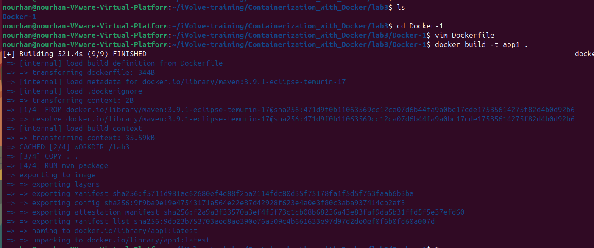
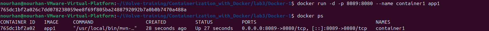
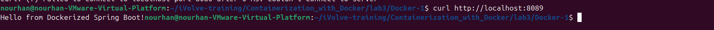
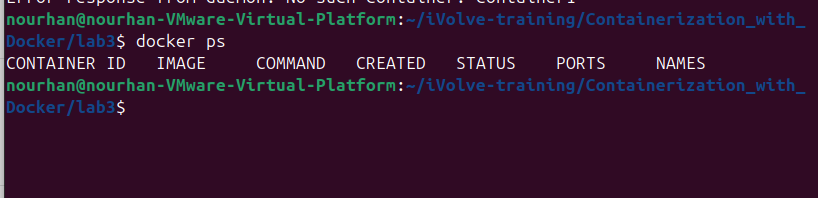

# Lab 3: Run Java Spring Boot App in a Container

## Summary

In this lab, we learned how to package a Java Spring Boot application using Maven and run it inside a Docker container.  
We built a Docker image from the project source code, ran the application in a container, and accessed it through a mapped port on the host machine.  

Key outcomes:
- Successfully built the Spring Boot JAR using Maven.
- Created a Docker image with the application.
- Ran the container and verified the application response using `curl`.
- Learned to handle container conflicts and clean old containers.


## Objective
This lab demonstrates how to run a Java Spring Boot application inside a Docker container.

## Requirements
- Java JDK 17
- Maven
- Docker

## Steps:

### 1. Clone the Application Code
```bash
 git clone https://github.com/Ibrahim-Adel15/Docker-1.git
```



### 2. build container:
```bash
    docker build -t app1 .
```



### 3. Run container:
```bash
    docker run -d -p 8089:8080 --name container1 app1
```



### 3. Test APP:
```bash
    curl http://localhost:8089
```



### 3. Stop container:
```bash
    docker stop container1
    docker rm container1

```



