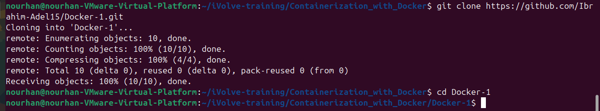
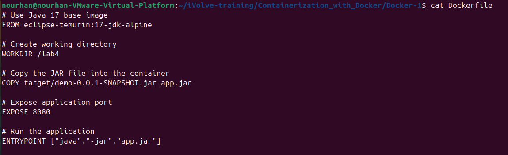
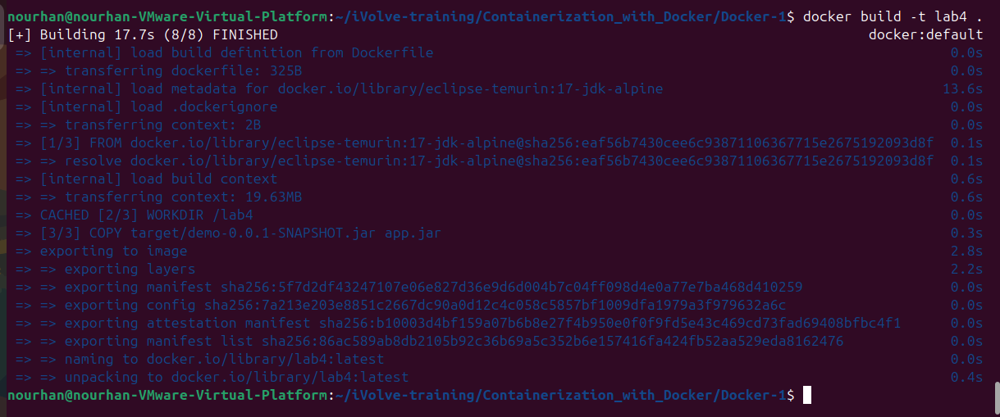
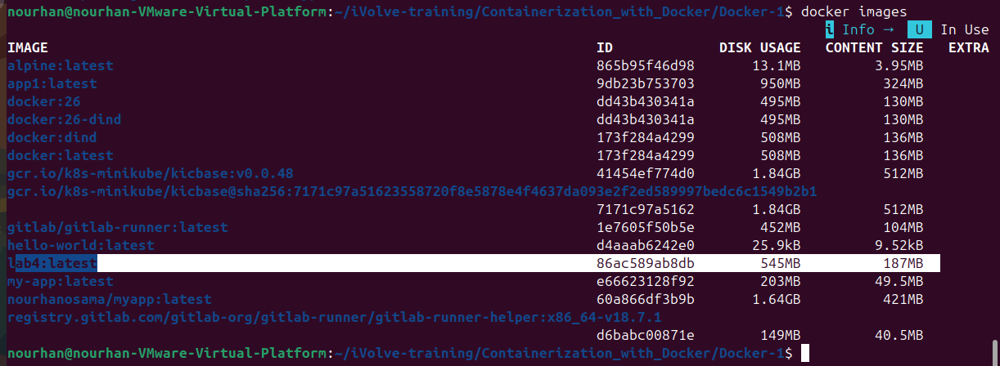
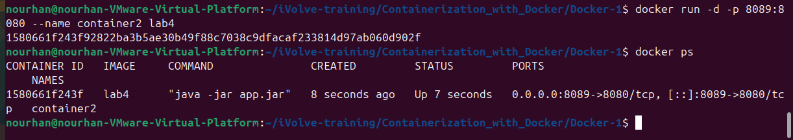
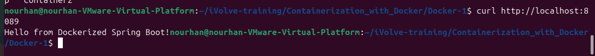
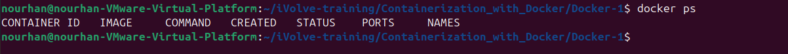

# Lab 4: Run Java Spring Boot App in a Container

## Steps
1. Clone the application repository.
2. Build the Spring Boot application using Maven.
3. Create a Dockerfile using Java 17 base image.
4. Build Docker image.
5. Run container and expose port.
6. Test the application using curl.
7. Stop and remove the container.

## Docker Commands
### Step 1: Clone the Application Repository
```bash
git clone https://github.com/Ibrahim-Adel15/Docker-1.git
cd Docker-1
```


### Step 2: Build the Application
```bash
mvn clean package
```


### Step 3: Write the Dockerfile
```bash
vim Dockerfile
```



### Step 4: Build the Docker Image
```bash
docker build -t lab4 .
```




### Step 5: Run the Container
```bash
docker run -d --name container2 -p 8080:8080 app2
```



### Step 6: Test the Application
```bash
curl http://localhost:8089
```



### Step 7: Stop and Remove the Container
```bash
docker stop container2
docker rm container2
```



