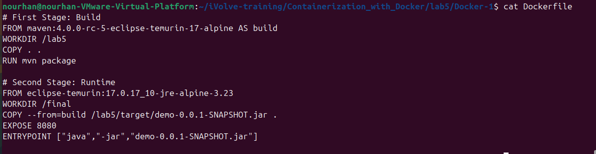
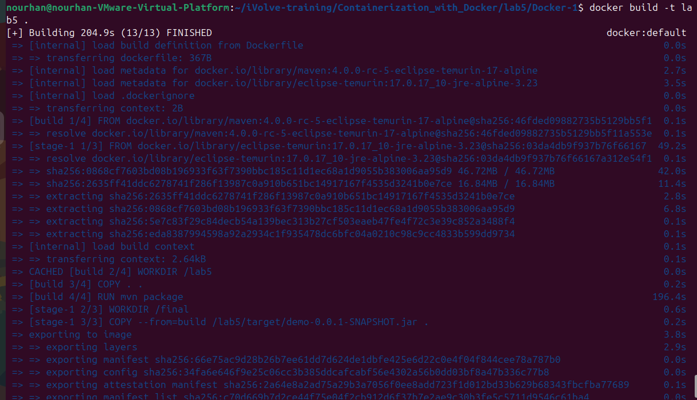
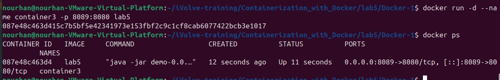
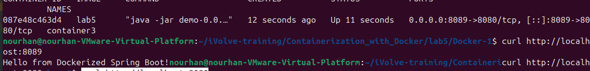
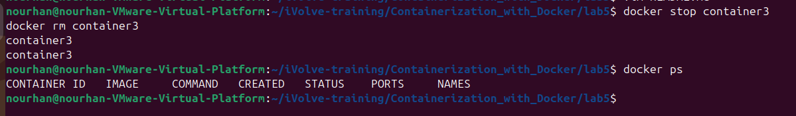

# Lab 5 – Multi-Stage Build for a Node.js App

## Objective
The purpose of this lab is to:  
- Build a **Node.js (Java) application** using a **multi-stage Docker build**.  
- Practice creating efficient Docker images by separating build and runtime stages.  
- Test and run the application in a container on port 8080.

## Prerequisites
- Docker installed on your local machine  
- Node.js and Java 17 (or Maven) installed for building the app  
- Basic knowledge of Docker multi-stage builds  

### Step 1: Clone the Application Repository
```bash
git clone https://github.com/Ibrahim-Adel15/Docker-1.git
cd Docker-1
```


### Step 2: Write the Dockerfile
```bash
vim Dockerfile
```



### Step 3: Build the Docker Image
```bash
docker build -t lab5 .
```



### Step 4: Run the Container
```bash
docker run -d --name container3 -p 8089:8080 lab5
```



### Step 5: Test the Application
```bash
curl http://localhost:8089
```



### Step 6: Stop and Remove the Container
```bash
docker stop container2
docker rm container2
```


