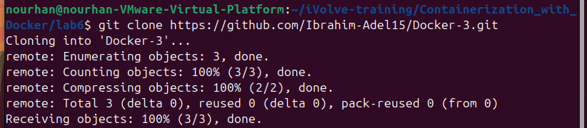
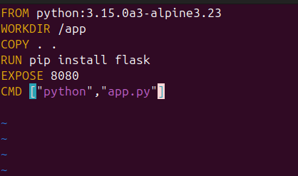
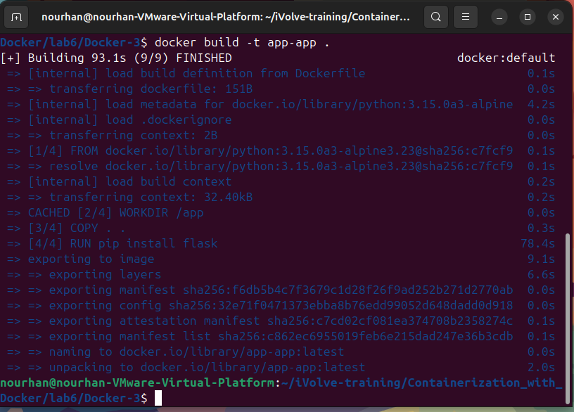
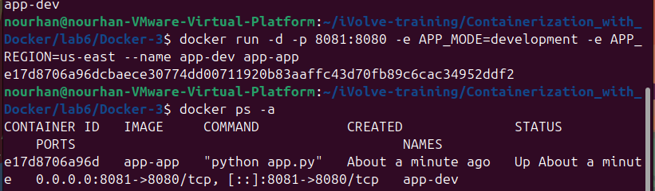
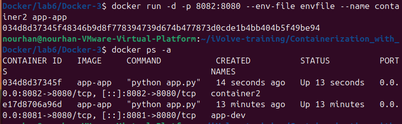
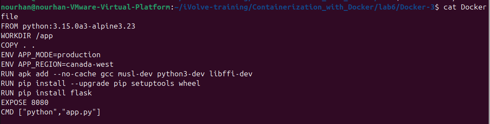
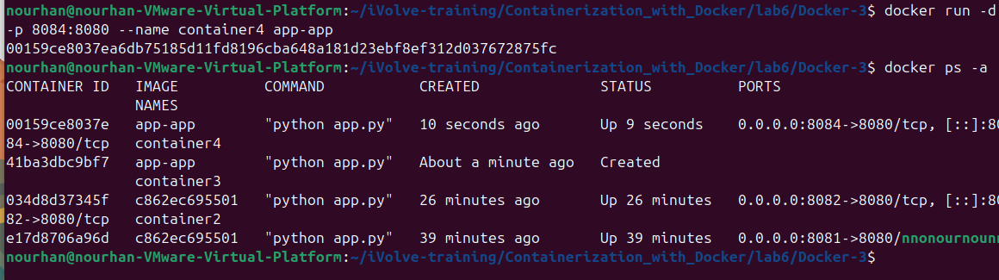
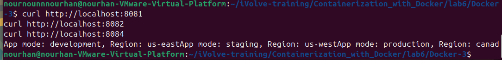
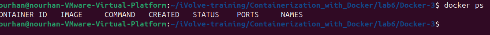

# Lab 6: Managing Docker Environment Variables Across Build and Runtime

## Overview
This lab demonstrates how to manage **Docker environment variables** both at **build-time** and **runtime**. We deploy a Python Flask application in three different environments (development, staging, and production) using different methods for setting environment variables.

## Objectives
- Clone the application code from GitHub
- Build a Docker image using a Python base image
- Install Flask inside the container
- Expose the application on port 8080
- Run the Flask app with different environment configurations
- Explore three methods to manage environment variables in Docker

## Prerequisites
- Docker installed on your system
- Basic knowledge of Docker commands
- Git installed to clone the repository

---

## Steps

### 1. Clone the Application Code
```bash
git clone https://github.com/Ibrahim-Adel15/Docker-3.git
cd Docker-3
```



### 2. Write the Dockerfile
```bash
vim Dockerfile
```



### 3. build docker image
``bash
docker build -t app-app .
``


### 4. step4 (firstmethod:(development, us-east) as variables in the command when run docker container)

```bash
docker run -d -p 8081:8080 -e APP_MODE=development -e APP_REGION=us-east --name container2 app-app
``



### (secondmethod:(staging, us-west) in a separate file and pass the file name in the command
- create envfile and put the variables on it 
```bash 
vim envfile
APP_MODE=staging
APP_REGION=us-west
``
- run method2
```bash
docker run -d -p 8082:8080 --env-file envfile --name container3 app-app
```



### (thiredmethod:(production, canada-west) in the Dockerfile
- modified Dockerfile 
```bash
vim Dockerfile
```


- build image again
- run method3
```bash
docker run -d -p 8084:8080 --name container4 app-app
```



### 5. test
```bash 
curl http://localhost:8081
curl http://localhost:8082
curl http://localhost:8084
```



### 6. stop and remove container
```bash
docker stop container2 container3 container4
docker rm container2 container3 container4
```



