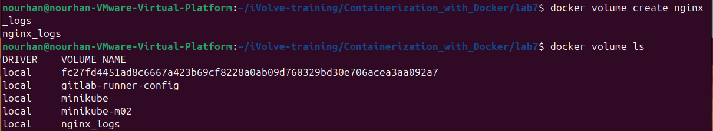
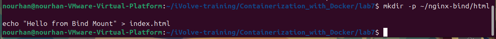
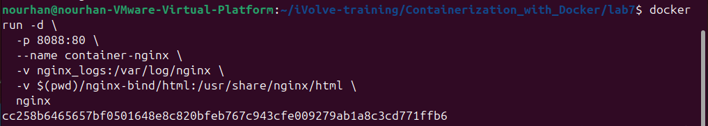
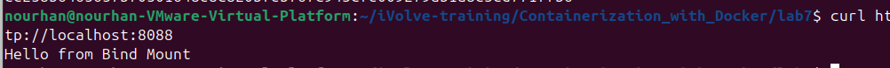
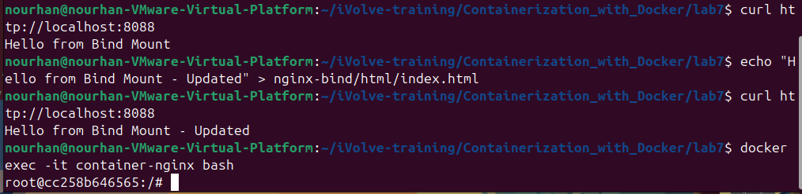
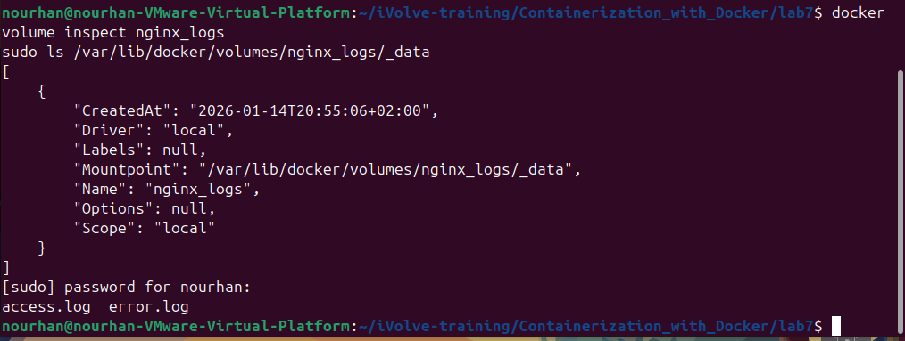
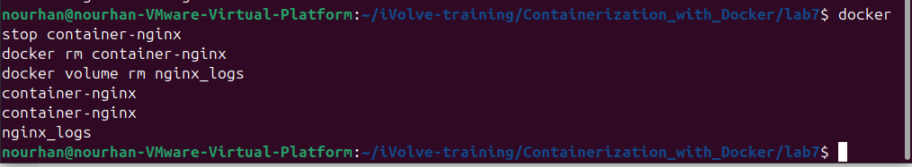

# Lab 7 – Docker Volume and Bind Mount with Nginx

## Objective
This lab demonstrates how to use **Docker Volumes** and **Bind Mounts** with an Nginx container in order to:
- Persist Nginx logs using a Docker volume.
- Serve a custom HTML file from the host machine using a bind mount.
- Verify real-time updates from the host to the container.

---

## Prerequisites
- Docker installed on the system
- Basic knowledge of Docker and Linux commands

---

## Step 1: Create Docker Volume
Create a Docker volume to store Nginx logs persistently.

```bash
docker volume create nginx_logs
docker volume inspect nginx_logs
```



### Step 2: Create Bind Mount Directory
```bash
mkdir -p nginx-bind/html
```



### Step 3: Create Custom HTML File
- Create an index.html file inside the bind mount directory
```bash
echo "Hello from Bind Mount" > nginx-bind/html/index.html
```


### Step 4: Run Nginx Container with Volume and Bind Mount
### Run the Nginx container using:
- Docker volume for logs
- Bind mount for HTML content
- Port mapping on 8088
```bash
docker run -d -p 8088:80 --name container-nginx -v nginx_logs:/var/log/nginx -v $(pwd)/nginx-bind/html:/usr/share/nginx/html  nginx
```



### Step 5: Verify Nginx Page
```bash
curl http://localhost:8088
```



### Step 6: Update HTML File and Verify
- Modify the index.html file on the host machine.
```bash
echo "Hello from Bind Mount - Updated" > nginx-bind/html/index.html
```
- Verify again:
```bash
curl http://localhost:8088
```



### Step 7: Verify Logs Inside the Volume
```bash
docker exec -it container-nginx ls /var/log/nginx
```



Step 9: Stop and Remove the Container and Delete the Docker Volume
```bash
docker stop container-nginx
docker rm container-nginx
docker volume rm nginx_logs
docker volume ls
```


