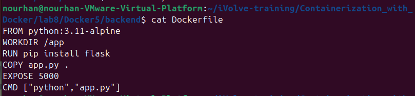
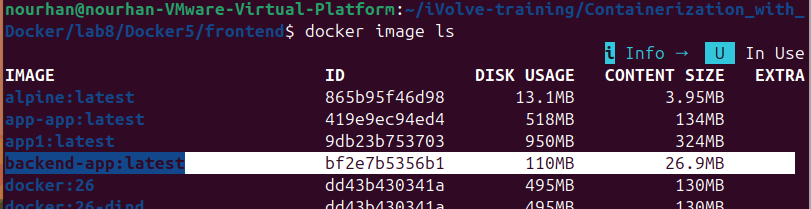
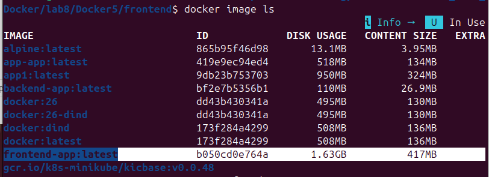
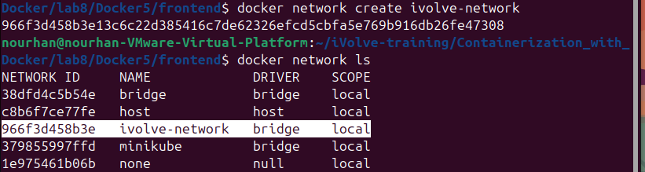
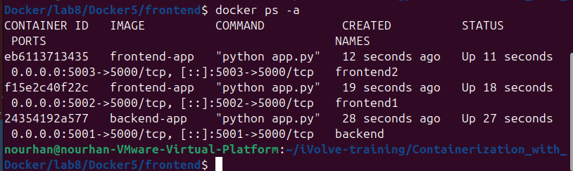

# Lab 8: Custom Docker Network for Microservices

## 📌 Objective
The goal of this lab is to demonstrate how Docker custom networks enable communication between microservices containers, and how containers on different networks cannot communicate using container names.

---

## 📂 Project Structure
.
└── Docker5
    ├── backend
    │   ├── app.py
    │   └── Dockerfile
    └── frontend
        ├── app.py
        ├── Dockerfile
        └── requirements.txt

4 directories, 5 files


---

### 1. Clone the Repository
```bash
git clone https://github.com/Ibrahim-Adel15/Docker5.git
cd Docker5
`

### 2. Backend Dockerfile
```bash
vim Dockerfile
```



### 3. Build Backend Image
```bash
cd backend
docker build -t backend-app .
```



### 4. Frontend Dockerfile
```bash
vim Dockerfile
```


### 5. Build frontend Image
```bash
cd ../frontend
docker build -t frontend-app .
```



### 6.Create Custom Docker Network
```bash
docker network create ivolve-network
docker network ls
```



### 7. Run 3 containers 
- Run Backend Container on Custom Network
- Run Frontend Container (frontend1) on Custom Network
- Run Frontend Container (frontend2) on Custom Network

```bash
docker run -d \
--name backend \
--network ivolve-network \
-p 5001:5000 \
backend-app
```

```bash
docker run -d \
--name frontend1 \
--network ivolve-network \
-p 5002:5000 \
frontend-app
```

```bash
docker run -d \
--name frontend2 \
-p 5003:5000 \
frontend-app
```




### 8. Verify Communication
- Frontend1 (Same Network)
```bash
curl http://localhost:5002
```


- Frontend2 (Default Network)
```bash
curl http://localhost:5003
```


### conclusion
- Containers connected to the same custom Docker network can communicate using container names.
- Containers on different networks cannot resolve each other.
- Custom networks provide isolation and controlled communication for microservicesarchitectures.


