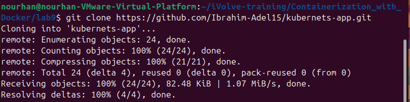
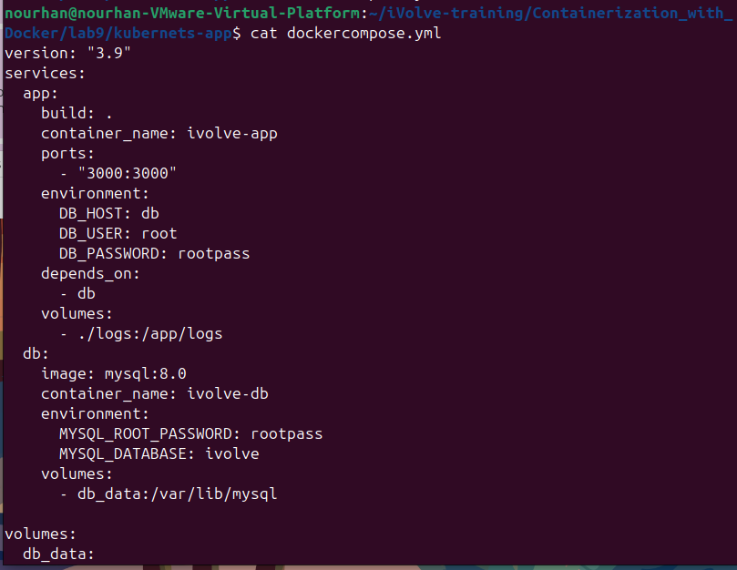
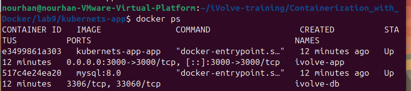
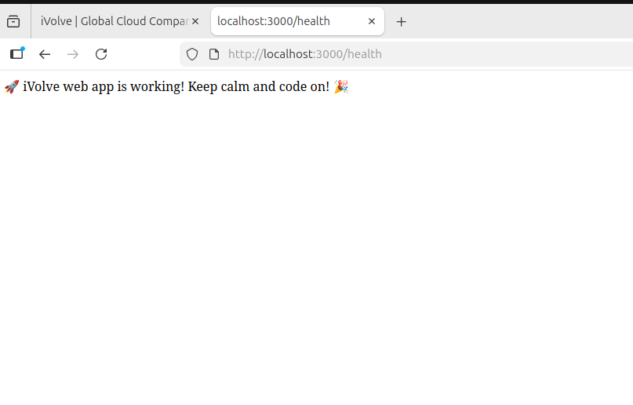
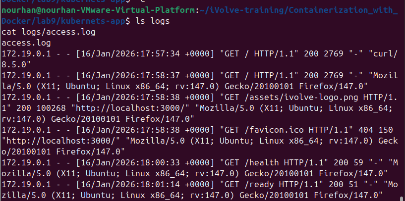
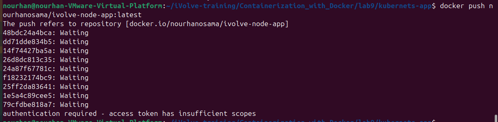

### Lab 9: Containerized Node.js & MySQL using Docker Compose
### Objective:
Deploy a Node.js application connected to a MySQL database using Docker Compose,verify health endpoints, logs, and push the image to DockerHub.

### 1. Clone the Application
```bash
git clone https://github.com/Ibrahim-Adel15/kubernets-app.git
cd kubernets-app
```



### 2. docker-compose.yml
```bash
vim dockercompose.yml
```



### 3. Run the Stack
```bash
docker compose -f docker-compose.yml up -d
docker ps
```



### 4. Verify Application
- Main App
```bash
curl http://localhost:3000
```


- Health Check
```bash
curl http://localhost:3000/health
```



- Readness Probe
```bash
curl http://localhost:3000/ready
```


- Verify Logs
```bash
ls logs
cat logs/access.log
```



### 5.docker login
```bash
docker login
```

```bash
docker tag kubernets-app-app <dockerhub-username>/ivolve-node-app:latest
docker push <dockerhub-username>/ivolve-node-app:latest
```



### summery:
This lab demonstrates how to containerize a Node.js application and a MySQL database using Docker Compose. The application and database run as separate services and communicate through a custom Docker network created by Docker Compose. Environment variables are used to configure the database connection, while Docker volumes ensure data persistence. The lab also verifies application health and readiness endpoints, application logging, and pushing the final Docker image to DockerHub.


